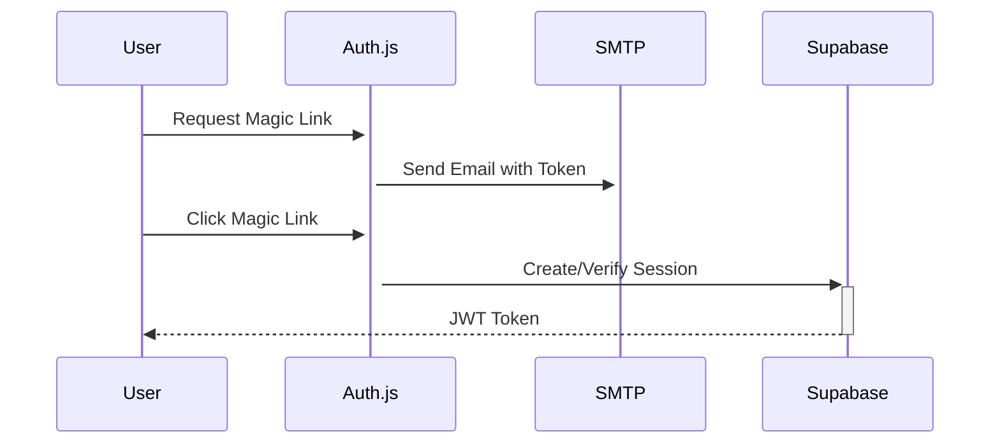
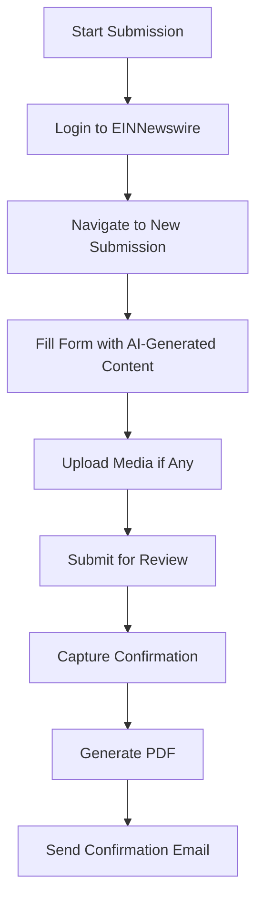

# Brava Press Launchpad - System Architecture

## Overview
Brava Press Launchpad is a SaaS platform that automates the creation, validation, and distribution of press releases through EINNewswire, powered by AI and serverless architecture.

## Core Dependencies

### Primary Dependencies
- **Authentication**: Auth.js (NextAuth)
- **Payments**: Stripe
- **AI Processing**: OpenAI API (GPT-4)
- **Web Automation**: Playwright
- **Email**: Resend API
- **Database**: PostgreSQL (Supabase)
- **Frontend**: Next.js 14 (App Router), React 18, TypeScript, Tailwind CSS, ShadCN/ui
- **Deployment**: DigitalOcean Droplet (Docker)

## System Architecture

### 1. Authentication Flow


### 2. Payment & Press Release Flow
1. **Pre-Payment**
   - User selects "Create New Press Release"
   - System shows payment modal with service details
   - User completes Stripe payment
   - System creates draft press release record

2. **AI-Powered Content Creation**
   - User provides company details and newsworthy event
   - System calls OpenAI API to generate:
     - Press Release Title
     - Twitter Title
     - Summary
     - Full Body Content
   - Content is editable before submission

3. **Content Validation**
   - System sends content to OpenAI for compliance check
   - AI validates against EINNewswire guidelines
   - Returns pass/fail with feedback if failed

### 3. EINNewswire Integration


### 4. Distribution Report Flow
1. **Scheduled Task** (24h after release)
   - System triggers report retrieval
   - Playwright logs into EINNewswire
   - Navigates to Distribution Report
   - Extracts and stores report URL
   - Sends email with report link

## Database Schema (Supabase)

### Tables
1. `users`
   - id (uuid)
   - email (string)
   - created_at (timestamp)
   - updated_at (timestamp)

2. `press_releases`
   - id (uuid)
   - user_id (uuid, foreign key)
   - status (draft/pending/published/failed)
   - payment_intent_id (string)
   - content (jsonb)
   - validation_result (jsonb)
   - ein_submission_id (string)
   - report_url (string)
   - scheduled_time (timestamp)
   - created_at (timestamp)
   - updated_at (timestamp)

3. `payments`
   - id (uuid)
   - user_id (uuid, foreign key)
   - press_release_id (uuid, foreign key)
   - amount (integer)
   - currency (string)
   - status (string)
   - receipt_url (string)
   - created_at (timestamp)

## API Endpoints

### Authentication
- `POST /api/auth/signin` - Request magic link
- `GET /api/auth/callback` - Handle magic link callback

### Press Releases
- `GET /api/press-releases` - List user's press releases
- `POST /api/press-releases` - Create new press release (starts payment flow)
- `GET /api/press-releases/:id` - Get press release details
- `PATCH /api/press-releases/:id` - Update press release
- `POST /api/press-releases/:id/submit` - Submit for distribution

### Payments
- `POST /api/payments/webhook` - Stripe webhook handler
- `GET /api/payments/:id` - Get payment status

## Environment Variables
```
# Core
NODE_ENV=production
NEXTAUTH_URL=
NEXTAUTH_SECRET=

# Supabase
NEXT_PUBLIC_SUPABASE_URL=
SUPABASE_SERVICE_ROLE_KEY=

# Stripe
STRIPE_SECRET_KEY=
STRIPE_WEBHOOK_SECRET=
NEXT_PUBLIC_STRIPE_PUBLISHABLE_KEY=
STRIPE_PRICE_ID=

# OpenAI
OPENAI_API_KEY=

# Resend
RESEND_API_KEY=
EMAIL_FROM=

# EINNewswire
EIN_USERNAME=
EIN_PASSWORD=
```

## Implementation Phases

### Phase 1: Core Infrastructure (Week 1-2)
- [ ] Set up Next.js with TypeScript
- [ ] Configure Auth.js with Magic Link
- [ ] Implement Supabase integration
- [ ] Set up Stripe payment processing
- [ ] Create basic UI components with ShadCN

### Phase 2: AI Integration (Week 3-4)
- [ ] Implement OpenAI API integration
- [ ] Build press release generation flow
- [ ] Create content validation system
- [ ] Implement draft saving/editing

### Phase 3: EINNewswire Automation (Week 5-6)
- [ ] Build Playwright automation
- [ ] Implement submission flow
- [ ] Create status tracking
- [ ] Set up email notifications

### Phase 4: Testing & Polish (Week 7-8)
- [ ] End-to-end testing
- [ ] Performance optimization
- [ ] Security audit
- [ ] Documentation

## Security Considerations
1. **Data Protection**
   - Encrypt sensitive data at rest
   - Use HTTPS for all communications
   - Implement rate limiting on API endpoints

2. **Authentication**
   - Secure JWT handling
   - Session management
   - Magic link expiration

3. **Payment Security**
   - Never store payment details
   - Use Stripe Elements for card input
   - Verify webhook signatures

## Monitoring & Maintenance
1. **Error Tracking**
   - Sentry for error monitoring
   - Logging for all API calls

2. **Performance**
   - Vercel Analytics
   - Database query optimization

3. **Backups**
   - Daily database backups
   - Versioned storage for press releases

## Future Enhancements
1. Multi-language support
2. Additional newswire integrations
3. Advanced analytics dashboard
4. Team collaboration features
5. API access for enterprise clients
